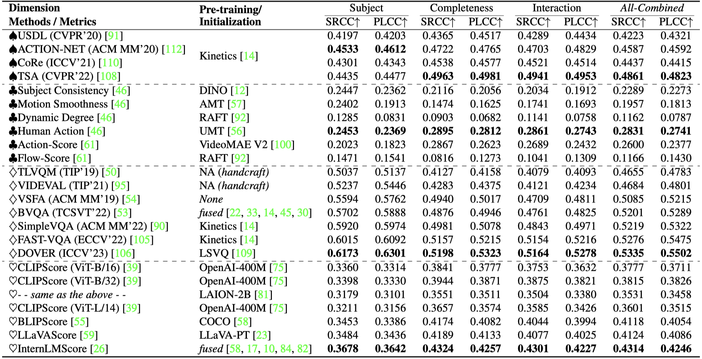

<div align="center">
<div>
<a href="https://github.com/zijianchen98/GAIA"></a>
    <a href="https://github.com/zijianchen98/GAIA"></a>
    <a href="https://arxiv.org/abs/2406.06087"></a>
    <a href="https://github.com/zijianchen98/GAIA"></a>
    <a href="https://github.com/zijianchen98/GAIA"></a>
</div>

<h1>GAIA: Rethinking Action Quality Assessment for AI-Generated Videos📽️📊</h1>

<!-- <p></p> 
🕺🤞😀
-->

_Assessing action quality is both imperative and challenging due to its significant
impact on the quality of AI-generated videos_

<div>
    <a href="https://scholar.google.com.hk/citations?hl=zh-CN&user=NSR4UkMAAAAJ" target="_blank">Zijian Chen</a><sup>1</sup>,
    <a href="https://scholar.google.com.hk/citations?hl=zh-CN&user=nDlEBJ8AAAAJ" target="_blank">Wei Sun</a><sup>1</sup>,
    <a href="https://scholar.google.com.hk/citations?hl=zh-CN&user=Kzd0qtsAAAAJ" target="_blank">Yuan Tian</a><sup>1</sup>,
    <a>Jun Jia</a><sup>1</sup>,
    <a href="https://scholar.google.com.hk/citations?hl=zh-CN&user=QICTEckAAAAJ" target="_blank">Zicheng Zhang</a><sup>1</sup>, <br>
    <a>Jiarui Wang</a><sup>1</sup>,
    <a>Ru Huang</a><sup>2</sup>,
    <a href="https://scholar.google.com.hk/citations?hl=zh-CN&user=91sjuWIAAAAJ" target="_blank">Xiongkuo Min</a><sup>1</sup>,
    <a href="https://scholar.google.com.hk/citations?hl=zh-CN&user=E6zbSYgAAAAJ" target="_blank">Guangtao Zhai</a><sup>1*</sup>,
    <a href="https://ee.sjtu.edu.cn/FacultyDetail.aspx?id=14&infoid=66&flag=66" target="_blank">Wenjun Zhang</a><sup>1</sup>
</div>

<div>
  <sup>1</sup>Shanghai Jiao Tong University,&nbsp&nbsp <sup>2</sup>East China University of Science and Technology
</div>   

<div>
<sup>*</sup>Corresponding author 
</div>

中文版速递：[知乎](https://zhuanlan.zhihu.com/p/704035511)


<div style="width: 100%; text-align: center; margin:auto;">
      
  </div>

</div>

> Motivation: 1. **_Action quality_** owns a significant impact on **_the quality of AI-generated videos_**. 2. Current action quality assessment (AQA) studies predominantly predominantly focus on **_domain-specific actions_** from real videos and collect **_coarse-grained expert-only_** human ratings on limited dimensions.

## Release
- [2024/6/18] 🔥 The proposed GAIA dataset is online!! Download it by [OneDrive](https://1drv.ms/u/c/0c2191cb01cbf002/EVwy88ItJV5CsynaboGzzqIBxGzHNxt_VwnunyZEIZ6B9g?e=PH7HRc) or [Baidu Netdisk](https://pan.baidu.com/s/13-N5A77Hgd3Vz5q-D2qkWA?pwd=utra) using Code: utra
- [2024/6/17] 🔥 We upload the used action prompt in `prompts_all.csv` as well as its corresponding category (`action_label.xlsx`)
- <p><del>[2024/6/11]  We are preparing the GAIA data and meta information.<p><del>
- [2024/6/6]  [Github repo](https://github.com/zijianchen98/GAIA) for **GAIA** is online.

## Info of GAIA Dataset

Download the GAIA (9,180 videos) from the released link ([OneDrive](https://1drv.ms/u/c/0c2191cb01cbf002/EVwy88ItJV5CsynaboGzzqIBxGzHNxt_VwnunyZEIZ6B9g?e=PH7HRc) or [Baidu Netdisk](https://pan.baidu.com/s/13-N5A77Hgd3Vz5q-D2qkWA?pwd=utra) using Code: utra)

Video naming rules: `(model name)_(action keyword).mp4`

Action keywords also serve as the index to search the corresponding action prompt in `prompts_all.csv` 

```
GAIA
|
|--videos
|  |-- Anmidiff_Abseiling.mp4
|  |-- Anmidiff_Admiration.mp4
|  |-- ...
|  |-- zeroScope_Zumba.mp4
|
|-- MOS.csv
```
### Info of MOS.csv
| filename | final action subject | final action completeness | final action interaction |

|  Anmidiff_Abseiling.mp4  | 49.0098 | 46.9289 | 52.1406 |
| ...  |  ... | ... | ... |


## Dataset Construction
In this work, we opt to collect annotations from a novel **_causal reasoning syllogism_**-based perspective. We decompose an action process into three parts: 1) **_action subject as major premise_**, 2) **_action completeness as minor premise_**, and 3) **_action-scene interaction as conclusion_**. The rationales for this strategy are as follows: **(a)** As the visual saliency information in action-oriented videos, the rendering quality of the action subject can profoundly affect the visibility of the action, while humans excel at perceiving such generated artifacts. **(b)** Moreover, unlike parallel-form feedbacks, the order of these three parts in action syllogism inherently aligns with the human reasoning process.

As a result, a total of 971,244 ratings among 9,180 video-action pairs were collected.


<div style="width: 100%; text-align: center; margin:auto;">
      
</div>

## Glance at the Performance of T2V Models in Action Generation
We evaluate 18 popular text-to-video (T2V) models on their ability to generate visually rational actions, revealing their pros and cons on different categories of actions.


#### Model-wise Comparison
For **_open-source lab studies_**, VideoCrafter2 takes the first place. For **_large-scale commercial applications_**, Morph Studio and Stable Video take the first and second place.

<div align="center">
<div style="width: 100%; text-align: center; margin:auto;">
  
</div>
</div>

#### Class-wise Comparison
Existing T2V models struggle to render **_actions with drastic motion changes_**, where atypical body postures are more easily involved. Additionally, when it comes to the local hand action categories, the actions contain **_subtle movements_** receive significantly lower MOSs than others, showing the inferior capacity of generating fine-grained actions.

<div align="center">
<div style="width: 100%; text-align: center; margin:auto;">
  
</div>
</div>

## Performance Benchmark on GAIA
**_All-Combined_** indicates that we sum the MOS of three dimensions and rescale it to [$0,100$] as the overall action quality score. $\spadesuit$, $\clubsuit$, $\diamondsuit$, and $\heartsuit$ denote the evaluated **conventional AQA method**, **action-related metrics**, **VQA methods**, and **video-text alignment metrics**, respectively.

<div style="width: 100%; text-align: center; margin:auto;">
  
</div>

## Quick Access of T2V Models
| Model |Code/Project Link |
|---|---|
|Text2Video-Zero|https://github.com/Picsart-AI-Research/Text2Video-Zero|
|ModelScope|https://modelscope.cn/models/iic/text-to-video-synthesis/summary|
|ZeroScope|https://huggingface.co/cerspense/zeroscope_v2_576w|
|LaVie|https://github.com/Vchitect/LaVie|
|Show-1|https://github.com/showlab/Show-1|
|Hotshot-XL|https://github.com/hotshotco/Hotshot-XL|
|AnimateDiff|https://github.com/guoyww/AnimateDiff|
|VideoCrafter1-512 / VideoCrafter1-1024 / VideoCrafter2|https://github.com/AILab-CVC/VideoCrafter|
Mora|https://github.com/lichao-sun/Mora|
Gen-2|https://research.runwayml.com/gen2|
Genmo|https://www.genmo.ai|
Pika|https://pika.art/home|
NeverEnds|https://neverends.life|
MoonValley|https://moonvalley.ai|
Morph Studio|https://www.morphstudio.com|
Stable Video|https://www.stablevideo.com/welcome|


## Contact

Please contact the first author of this paper for queries.

- Zijian Chen, `zijian.chen@sjtu.edu.cn`

## Citation
If you find our work interesting, please feel free to cite our paper:
```
@article{chen2024gaia,
  title={GAIA: Rethinking Action Quality Assessment for AI-Generated},
  author={Chen, Zijian and Sun, Wei and Tian, Yuan and Jia, Jun and Zhang, Zicheng and Wang, Jiarui and Huang, Ru and Min, Xiongkuo and Zhai, Guangtao and Zhang, Wenjun},
  journal={arXiv preprint arXiv:2406.06087},
  year={2024}
}
```